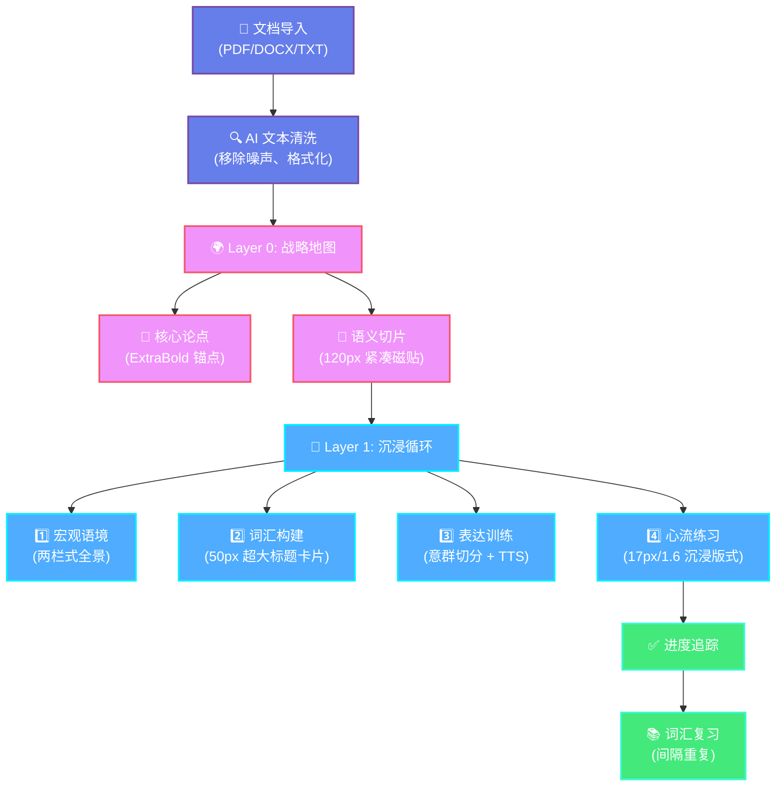

# Deep Internalizer（深度内化阅读器）

[](https://vitejs.dev/)
[](https://react.dev/)
[](https://github.com/your-repo)
[](https://developer.mozilla.org/en-US/docs/Web/Progressive_web_apps)
[](design/)

> **"阅读的目的不是为了读完更多的书，而是为了让更少的内容在穿过你的灵魂时不留痕迹。"**
>
> — Deep Internalizer: 让每一行文字都真正转化为你的长期记忆。

---

## 🎯 2026 全新视觉重构 (v0.4.0)

我们刚刚完成了整个应用从 **Layer 0 (战略地图)** 到 **Layer 1 (沉浸循环)** 的 **1:1 像素级视觉重构**。基于 Pencil 专业设计规范，带来了全新的“杂志级”阅读美学与工程严谨性。

### 💎 核心视觉更新
- **杂志美学 (Editorial Design)**：全站统一使用 **Inter** 字体，摒弃衬线干扰，建立极简、高效的学术阅读质感。
- **实体锚点布局**：引入 1224px 黄金宽度约束与 8pt 栅格系统，主卡片锁定视觉重心，确保在 1440px 笔记本屏幕下展现出极强的“物理存在感”。
- **统一主题引擎 (Unified Theme)**：实现了全局同步的昼夜模式切换。点击 "Theme" 按钮，整站背景、卡片渐变及文字对比度将瞬间无缝响应。
- **全流程导航 (Phase Tabs)**：顶层 Header 集成了 4 步循环切换按钮，支持在“宏观语境”、“词汇构建”、“表达训练”与“心流阅读”之间非线性穿梭。

---

## 🏗️ 架构：双层认知漏斗

Deep Internalizer 使用**双层认知漏斗**将原始文本转化为内化知识：


```mermaid
graph TB
    %% 文档导入
    Import["📄 文档导入<br/>(PDF/DOCX/TXT)"] --> Parse["🔍 AI 文本清洗<br/>(移除噪声、格式化)"]
    Parse --> L0["🌍 Layer 0: 战略地图"]
    
    %% Layer 0: 全局分析
    L0 --> Thesis["📌 核心论点<br/>(ExtraBold 锚点)"]
    L0 --> Chunks["🧩 语义切片<br/>(120px 紧凑磁贴)"]
    
    %% Layer 1: 沉浸循环
    Chunks --> L1["🎯 Layer 1: 沉浸循环"]
    
    L1 --> Step1["1️⃣ 宏观语境<br/>(两栏式全景)"]
    L1 --> Step2["2️⃣ 词汇构建<br/>(50px 超大标题卡片)"]
    L1 --> Step3["3️⃣ 表达训练<br/>(意群切分 + TTS)"]
    L1 --> Step4["4️⃣ 心流练习<br/>(17px/1.6 沉浸版式)"]
    
    %% 进度追踪
    Step4 --> Progress["✅ 进度追踪"]
    Progress --> Review["📚 词汇复习<br/>(间隔重复)"]
    
    %% 样式
    classDef importNode fill:#667eea,stroke:#764ba2,stroke-width:2px,color:#fff
    classDef layer0Node fill:#f093fb,stroke:#f5576c,stroke-width:2px,color:#fff
    classDef layer1Node fill:#4facfe,stroke:#00f2fe,stroke-width:2px,color:#fff
    classDef outputNode fill:#43e97b,stroke:#38f9d7,stroke-width:2px,color:#fff
    
    class Import,Parse importNode
    class L0,Thesis,Chunks layer0Node
    class L1,Step1,Step2,Step3,Step4 layer1Node
    class Progress,Review outputNode
```

---

## 🚀 性能与稳定性增强

- **瞬间跳转 (Zero Latency)**：通过 `PrefetchService` 实现关键词后台预取，Layer 0 到 Layer 1 的切换感官延迟 < 100ms。
- **稳健性修复**：修复了旧版中存在的页面空白 (Whiteout) 根因、Explore Map 按钮路由失效以及 CSS Module 样式冲突等技术债务。
- **智能音频缓存**：词汇与音节级缓存将 TTS 调用减少了 90%，并提供顺滑的 Syllable-by-Syllable 播放体验。

---

## 🛠️ 快速启动（推荐开发模式）

为获得完整体验，建议在本地同时启动以下 3 个核心服务：

### 1. 安装环境
```bash
# 克隆仓库
git clone https://github.com/your-repo/deep-internalizer.git
cd deep-internalizer

# 安装前端与 Bridge 依赖
npm install
cd bridge && npm install && cd ..
```

### 2. 配置环境
创建 `.env.local` 文件：
```bash
VITE_LLM_PROVIDER=deepseek
VITE_DEEPSEEK_API_KEY=你的_API_密钥
```

### 3. 一键启动 (3 终端同步)
```bash
# 终端 1：React 前端 (Vite)
npm run dev

# 终端 2：Bridge Server (Node.js) - 负责分析与缓存
npm --prefix bridge run start

# 终端 3：TTS Server (Python) - 负责高保真语音
./scripts/start_tts.sh
```

---

## 📂 项目结构

```text
src/
├── components/
│   ├── Layer0/              # 全局语义地图 (1:1 Pencil Refactor)
│   ├── Layer1/              # 4步沉浸循环 (1:1 Pencil Refactor)
│   │   ├── SegmentLoop.jsx      # 流程调度中心
│   │   ├── VocabularyCard.jsx   # 50px 标题基准卡片
│   │   └── SentenceCard.jsx     # 38px 表达训练卡片
│   └── common/              # 共享组件 (ThemeToggle, ImportModal)
├── stores/
│   └── appStore.js          # Zustand 全局状态 (Theme, Doc, Step)
├── services/
│   ├── prefetchService.js   # 后台预加载管理
│   └── llmClient.js         # 多提供商 LLM 客户端
└── db/
    └── schema.js            # IndexedDB 模式 (Dexie.js)

bridge/                      # Claude Code & Analysis Bridge
scripts/                     # TTS Server & Automation Scripts
```

---

## 📜 许可证与愿景

**MIT License**

Deep Internalizer 不仅仅是一个阅读工具，它是一个**认知增强器**。我们致力于通过技术手段，让每一个人都能在信息爆炸的时代，重获深度思考与知识内化的能力。

---

> [!TIP]
> **版本**：v0.4.0 (2026-03-07)  
> **重点**：1:1 设计复原 + 全局主题同步 + 导航闭环  
> **下一步**：知识图谱可视化、协作阅读模式、移动端适配

**Generated by Antigravity · Engineering Excellence**
