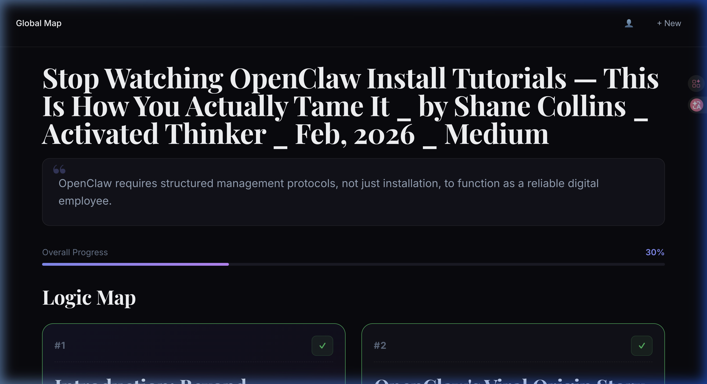
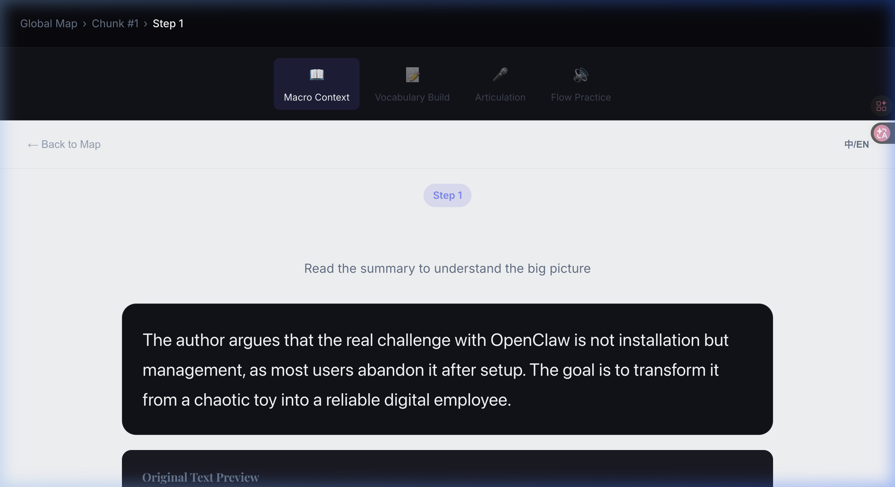
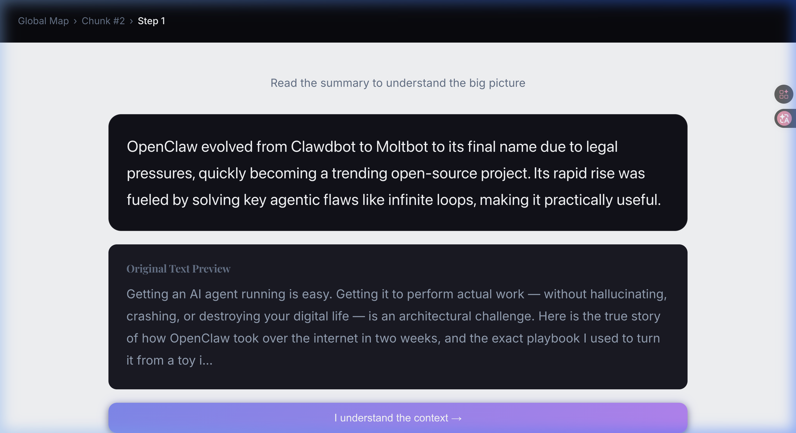
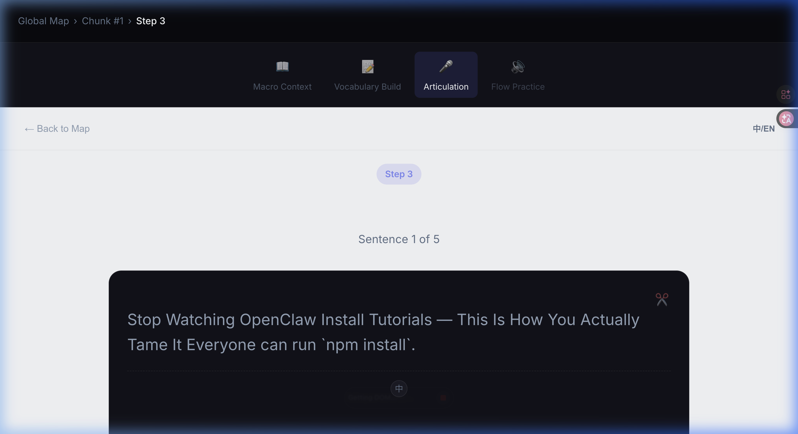

# Deep Internalizer — 页面功能与后台数据映射

> 本文档为设计重构前的完整功能画像，每个页面均附有当前状态截图、功能点列表，以及对应的后台 IndexedDB 数据表调用关系。
> 数据库引擎：**Dexie.js (IndexedDB)**，Schema 定义于 `src/db/schema.js`。

---

## 数据库全局总览

| 表名 | 键 | 用途 |
|------|-----|------|
| `documents` | `id` | 导入的原文文档 |
| `chunks` | `id, docId, index` | 文档切块（语义段落） |
| `words` | `id, chunkId, text, status` | 生词条目 (`pending / reviewing / archived`) |
| `reviewRecords` | `id, wordId` | 单词复习历史记录 |
| `readingSessions` | `docId` | 阅读进度持久化 |
| `userStats` | `date` | 每日学习热图统计 |
| `wordAudio` | `word` | TTS 发音音频缓存 |
| `syllableAudio` | `syllable` | 音节发音缓存 |
| `chunkKeywords` | `chunkId` | LLM 关键词分析缓存 |
| `sentenceTranslations` | `chunkId` | 句子翻译缓存 |
| `analysisCache` | `hash` | 文档全文分析结果缓存 |
| `thoughtGroups` | `hash` | 思维组（Thought Group）分组缓存 |

---

## 📌 页面 1 — Global Map（全局知识地图）| Layer 0



### 界面视觉元素 (UI Elements)
- **Top Navigation Bar (顶部导航栏)**: 包含左侧面包屑 (Breadcrumbs) `Global Map` 和右侧的全局操作图标 (如 Theme Toggle 昼夜切换, User Profile, Import New `+` 按钮)。
- **Greeting / Stats Header (欢迎面板/数据概览)**: 问候语 (`Welcome back`)、进度条、Heatmap 占位区及统计数字。
- **Document Card (文档承载卡片)**: 包含文档标题及进度提示。
- **Chunk Path / Nodes (学习路径节点)**:
  - 垂直分布的时间线/路径样式 (Path/Timeline style)。
  - 每个节点代表一个 Chunk (`Chunk #1`, `Chunk #2`)，旁边带有状态图标（如小火焰/未解锁/已完成 Check 标记）、标题和辅助文本。
- **Floating Action Button (FAB) / Import**: 右下角可能有的全局导入按钮。

### 功能点

| # | 功能 | 描述 |
|---|------|------|
| 1 | **文档入口** | 展示当前导入的文档，点击进入对应的 Chunk 列表 |
| 2 | **Import New Document** | 触发导入模态框 `ImportModal`，支持粘贴文本、URL |
| 3 | **导入进度展示** | 导入期间显示处理日志（`processingLogs`）与多步骤进度 |
| 4 | **Resume 阅读记录** | 展示上次的阅读进度卡片（`readingSessions.docId`） |
| 5 | **Chunk 进度概览** | 以列表/地图方式呈现每个 Chunk 的完成状态（`chunk.completed`） |
| 6 | **User Profile 入口** | 右上角跳转至个人设置和学习统计页面 |

### 后台数据调用

```js
// 核心数据读取
db.documents.toArray()              // 文档列表
db.chunks.where('docId').equals()   // 每篇文档的 chunks
db.readingSessions.get(docId)       // 恢复阅读位置

// 导入写入流程
createDocument(title, rawContent)            // 写入 documents
createChunksBulk(docId, [...chunks])         // 批量写入 chunks
setAnalysisCache(hash, coreThesis, chunks)   // 缓存 LLM 分析结果
```

---

## 📌 页面 2 — Layer 1, Step 1（宏观语境 Macro Context）



### 界面视觉元素 (UI Elements)
- **Layer 1 Header (学习层全局导航)**:
  - 顶部面包屑: `Global Map > Chunk #1 > Step 1`
  - 语言切换开关: 右上角 `中/EN` 悬浮按钮。
- **Step Navigation Tabs (步骤切换标签)**: 居中悬浮的选项卡模块 (`Macro Context`, `Vocabulary Build`, `Articulation`, `Flow Practice`)，带高亮背景表示当前所处步骤。
- **Title Block (标题区块)**: `Step 1` 标签 (Pill 样式)，配套主标题 `Macro Context` 及副操作提示 `Read the summary...`。
- **Summary Card (摘要卡片)**:
  - 大圆角深色背景卡片 (Dark Mode Theme)。
  - 英文主摘要段落 (大字号)。
  - 中文附属摘要段落 (如果有，以虚线 `divider` 与上方英文隔开，文字颜色稍浅)。
- **Original Preview Block (原文预览区块)**: `Original Text Preview` 标题及截断渐隐的原文预览段落。
- **Primary Action Button (主操作按钮)**: 底部居中的大号主色按钮 `I understand the context →`。

### 功能点

| # | 功能 | 描述 |
|---|------|------|
| 1 | **摘要阅读** | 显示 `chunk.summary`（英文）及 `chunk.summary_zh`（中文，双语模式下） |
| 2 | **双语切换** | 右上角 `中/EN` 按钮控制 `isBilingual` 开关 |
| 3 | **原文预览** | 截取 `chunk.originalText` 前 300 字符作为提示 |
| 4 | **LLM 关键词预取** | 进入 Step 1 后开始后台调用 LLM 提取关键词，结果缓存到 `chunkKeywords` 表 |
| 5 | **TTS 暖机** | 在 idle time 提前加载前 2 个单词的TTS音频到 `wordAudio` 表缓存 |
| 6 | **"I understand the context →"** | 标记完成，推进到 Step 2。写入 `chunk.currentStep = 2` |

### 后台数据调用

```js
db.chunks.get(chunkId)                    // 读取当前 chunk 数据
db.chunkKeywords.get(chunkId)             // 快速检查是否有缓存关键词
prefetchService.prefetchKeywords(...)      // 后台 LLM 提取，写入 chunkKeywords
prefetchService.prefetchTTSForWords(...)  // 后台写入 wordAudio
db.chunks.update(id, { currentStep: 2 }) // 更新阅读步骤（由 App.jsx onStepComplete 触发）
```

---

## 📌 页面 3 — Layer 1, Step 2（词汇构建 Vocabulary Build）



### 界面视觉元素 (UI Elements)
- **Immersive Header (沉浸式导航头)**: 
  - 隐层的背景（无遮罩设计，与主体画布背景 `#F8FAFC` 融为一体）。
  - 左侧 `← Back to Map` 返回按钮 (Ghost Button)。
  - 顶部中间显示 Chunk Title 或当前模块。
  - 右侧双语按钮 `中/EN`。
- **Vocabulary Card (主干单词中心卡片)**: 
  - 极简白色圆角面片 (White Card) 带轻微弥散阴影。
  - **顶部发音区**: 超大磅值英文单词 (Hero font size)，下方紧跟音标 `/xxx/` 与圆形音频朗读按钮 (TTS icon)。
  - **分割线**: 居中虚线 `divider` 切分上下区域。
  - **Lemma Row (原形词性行)**: 分割线正下方同行显示。左侧：单词本体和小喇叭；右侧：词性 (如 `v.`, `n.`)。
  - **Definition Block (精析释义区)**: 英/中双语释义。包含由灰底圆角外框包裹的原境例句 (Context Sentence)，且例句中该词被加粗或高亮标示 (Highlight pill)。
- **Button Group (核心双操作区)**:
  - 横向排布的双按钮：左侧次级操作框 (Secondary Ghost) `I know this`；右侧主操作框 (Primary Solid) `Add to vocabulary`。
- **Progress Text (置底进度条)**: 卡片最下方的极微文本组件 `Word X of Y`。

### 功能点

| # | 功能 | 描述 |
|---|------|------|
| 1 | **单词卡片** | 展示当前单词的超大字体、音标、词性（`word.text / phonetic / pos`） |
| 2 | **发音（TTS）** | 点击音频按钮调用 `useTTS.speak()`，优先读 `wordAudio` 缓存 |
| 3 | **英文释义** | 展示 `word.definition`（含上下文例句高亮） |
| 4 | **`I know this` 按钮** | 跳过当前词，`handleSkipWord()`，不写入任何 DB |
| 5 | **`Add to vocabulary` 按钮** | 调用 `onWordAction('add', word)` → `createWordIfMissing()`，写入 `words` 表 |
| 6 | **防重复添加** | `addedWords Set` 本地去重；`createWordIfMissing()` DB 层去重 |
| 7 | **进度指示** | 底部 "Word X of Y" 文本，纯本地 state `currentWordIndex / words.length` |
| 8 | **loading骨架屏** | 关键词未返回时展示 skeleton cards（LLM 请求中） |
| 9 | **双语释义** | `isBilingual` 开启时额外展示 `word.definition_zh` |

### 后台数据调用

```js
// 读取
db.chunkKeywords.get(chunkId)    // 获取已缓存的关键词列表（words 数组）
db.wordAudio.get(word.text)      // 读取 TTS 缓存

// 写入（点击 Add to vocabulary）
createWordIfMissing(
  chunkId, text, phonetic, definition,
  originalContext, newContext, slices, pos, definition_zh
)  // → 写入 words 表（status = 'pending'）

// 统计
incrementUserStats({ words: 1 })   // 每成功添加一词，更新 userStats 当日 words 计数
```

---

## 📌 页面 4 — Layer 1, Step 3（发音练习 Articulation）



### 界面视觉元素 (UI Elements)
- **Layer 1 Header & Step Tabs**: 与 Step 1 复用（面包屑、语种切换、步骤标签）。
- **Title Block (意图区块)**: 标题 `Articulation`，及操作提示 `Read aloud with the active sentence`。
- **Sentence Card (句段逐句击破卡片)**:
  - 内容区承载一个完整句子，字体需兼顾阅读舒适度 (大号衬线/无衬线)。
  - **Thought Group Highlights (意群高亮标记)**: 句子按区块或意群呈现不同的底色高亮/下划线标注。
  - **Translation Block (附属翻译)**: 卡片底部或翻转态显示的对应中文参考翻译。
- **TTS Core Controls (发音控制器)**: 
  - 极为醒目的主播放按钮 `Play Audio` / `Speaker Icon`。
- **Pagination Array (翻页控制)**:
  - 底部左中右操作集群：左侧 `← Previous`，中间指示器 `X / Y`, 右侧 `Next →`。
- **Finish Button**: 单独的 `Done` 或完成练习推入下个环节的操作。

### 功能点

| # | 功能 | 描述 |
|---|------|------|
| 1 | **句子卡片（SentenceCard）** | 将 `chunk.originalText` 拆分为句子，逐句呈现 |
| 2 | **Thought Group 高亮** | 通过 `thoughtGroups` 缓存给句子按意群分组高亮显示 |
| 3 | **TTS 朗读** | 点击播放按钮听整句发音（`ttsService.js`），写入 `wordAudio` |
| 4 | **中文释义提示** | 双语模式显示 `sentenceTranslations` 缓存的中文翻译 |
| 5 | **上/下一句导航** | 纯本地 state 翻页，无 DB 写入 |
| 6 | **"Done" 完成按钮** | 推进至 Step 4，更新 `chunk.currentStep = 4` |

### 后台数据调用

```js
db.thoughtGroups.get(hash)              // 读取思维组缓存（hash = 句子内容 hash）
setThoughtGroupsCache(hash, groups)     // 若无缓存则 LLM 生成后写入
db.sentenceTranslations.get(chunkId)   // 读取句子翻译
db.wordAudio.get(text)                  // TTS 音频缓存读取
```

---

## 📌 页面 5 — Layer 1, Step 4（流利输出 Flow Practice）

> ⚠️ 本次自动化截图中 Step 4 页面未能到达，以下功能点通过代码分析推导。

### 界面视觉元素 (UI Elements)
- **Layer 1 Header & Step Tabs**: 与前置步骤复用。
- **Title Block**: 标题 `Flow Practice` 及通读提示。
- **Full Text Container (全文本容器)**: 与逐段不同的无分页无障碍全屏长文本阅读视图 (Full screen article view)。
- **Global Playback Strip (全局播放控制条)**: 吸底或悬浮的播放器，控制整篇文章的播放、暂停与进度。
- **Bilingual Subtext (双语贴边)**: 逐句的双语对照阅读格式 (Side-by-side or Interleaved lines)。
- **Completion Checkpoint (归档核验点)**: 位于文章末尾的大号完成按钮 `Mark Chunk as Completed`。

### 功能点

| # | 功能 | 描述 |
|---|------|------|
| 1 | **完整段落展示** | 展示整个 `chunk.originalText`，供流利朗读练习 |
| 2 | **TTS 全段朗读** | 整段文本转语音播放 |
| 3 | **双语对照** | 句子下方显示翻译 |
| 4 | **完成 Chunk** | 点击完成后 `chunk.completed = true`，写入 `userStats.segments += 1` |

### 后台数据调用

```js
db.chunks.update(id, { completed: true, currentStep: 4 })  // 标记完成
incrementUserStats({ segments: 1 })                         // 更新热图计数
saveReadingSession({ docId, chunkIndex, step: 4 })          // 写入 readingSessions
```

---

## 📌 页面 6 — Vocabulary Review（单词复习）

> 由全局守门机制触发（`LaunchInterception`），当 `pending words count` 超过阈值时进入。

### 功能点

| # | 功能 | 描述 |
|---|------|------|
| 1 | **A/B 对比卡片** | 展示单词的正反面（`text / definition`），滑动选择 |
| 2 | **"Keep"** | `addReviewRecord(wordId, 'keep')`，状态保持 `pending` |
| 3 | **"Archive"** | `word.status = 'archived'`，从待复习池移除 |
| 4 | **完成复习** | 返回 Global Map，统计中 `words += archived count` |

### 后台数据调用

```js
getPendingWords()                          // 读取所有 status='pending' 的词
db.words.update(id, { status: 'archived' }) // Archive 操作
addReviewRecord(wordId, action)            // 写入 reviewRecords
incrementUserStats({ words: N })           // 更新每日统计
```

---

## 📌 预留：组件与路由注册位置 (Component & Routing Reservations)

- **Theme Toggle (昼夜切换模型组件)**:
  - **组件路径**: `src/components/common/ThemeToggle.jsx` (预留占位符)
  - **挂载位置 (UI/视图)**:
    - `Global Map (全局知识地图)` 的 Layer0 Top Navigation Bar 右侧。
    - `Import Page` / `ImportModal` (导入模块) 的 `header` 右侧操作区。
  - **功能要求**: 点击切换并持久化 Dark / Light Theme，待具体设计稿给出后完善 UI 与逻辑。

---

## 核心服务概览

| 服务 | 文件 | 职责 |
|------|------|------|
| `prefetchService` | `services/prefetchService.js` | LLM 关键词 & TTS 音频预取调度 |
| `ttsService` | `services/ttsService.js` | 调用本地 TTS Bridge，管理 `wordAudio` / `syllableAudio` 缓存 |
| `chunkingService` | `services/chunkingService.js` | 文章切块与 LLM 语义分析 |
| `llmClient` | `services/llmClient.js` | 统一的 LLM 请求客户端（配置化模型选择） |
| `claudeCodeImporter` | `services/claudeCodeImporter.js` | Claude Code 导入流程，支持 `claudeCodeCache` |
