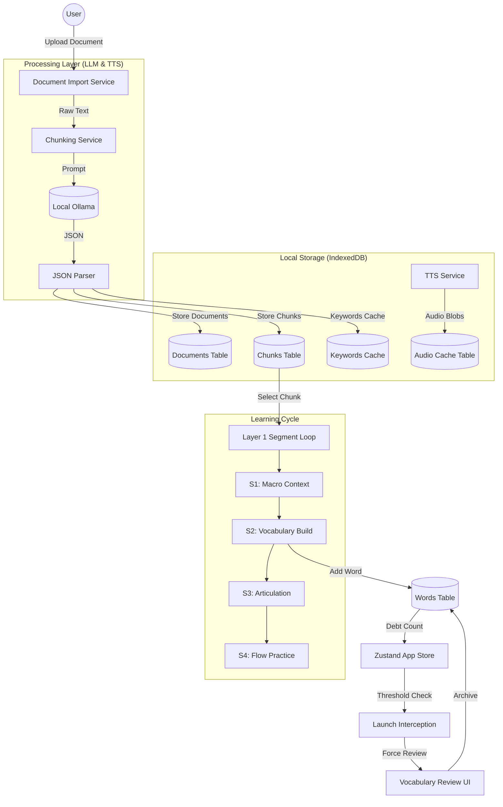

# Deep Internalizer 技术实现文档 (Technical Implementation Specification)

本文档详尽介绍了 **Deep Internalizer** 项目的核心架构、接口详情、功能实现及数据流转逻辑，旨在为后续的二次开发与维护提供深度技术背景。

---

## 1. 核心接口实现与通信协议 (Interfaces & Communication)

项目采用 **本地优先 (Local-First)** 架构，所有重量级计算（LLM 语义分析与 TTS 语音合成）均通过本地 API 完成。

### 1.1 大模型接口 (Local LLM API - Ollama)
系统深度集成 `Ollama` 提供语义切片、词汇提取及逻辑拆解。
- **Endpoint**: `http://localhost:11434/api/generate`
- **Model**: `llama3.1:latest` (Default)
- **通信格式**: JSON over HTTP

#### 核心 Prompt 策略：
| 功能模块 | Prompt 核心逻辑 | 输出结构摘要 |
| :--- | :--- | :--- |
| **Semantic Chunking** | 将长文按语义逻辑切分为 3-8 句的 Chunk。 | `[{title, summary, summary_zh, startIndex, endIndex}]` |
| **Keyword Extraction** | 提取 B2+ 难度词汇，包含音标分片 (Slices) 及新语境。 | `[{word, phonetic, slices: [[text, ipa]], definition, newContext}]` |
| **Thought Groups** | 将句子拆分为意群 (Thought Groups) 以优化朗读节奏。 | `[{text, hint (subject/action/detail)}]` |
| **Core Thesis** | 提取全篇文档的核心论点。 | `String (Max 30 words)` |

### 1.2 语音合成接口 (TTS API)
集成高性能 TTS 服务，支持精细化的音节级控制。
- **Endpoint**: `http://localhost:8000/v1/audio/speech`
- **Model**: `qwen3-tts` / `kokoro-onnx`
- **分级缓存策略**:
    - **Word Level**: 永久缓存于 IndexedDB (LRU 策略，上限 500 词)，因为词汇在不同文档中高度重合。
    - **Syllable Level**: 仅缓存常见前缀/后缀（如 `-tion`, `pre-`），提升组合发音效率。
    - **Sentence Level**: 不缓存，确保系统响应灵活性。

---

## 2. 功能模块详细实现 (Features Implementation)

### 2.1 Layer 0 - 全局蓝图 (Global Blueprint)
- **文档导入**: 支持 `.txt`, `.docx` (mammoth.js), `.pdf` (pdfjs-dist)。
- **分析流**: 采用 `Promise.all` 并行触发核心论点提取与语义分片，减少用户等待时间（~7s 优化至 ~4s）。
- **持久化**: 所有分片数据保存至 IndexedDB 的 `documents` 与 `chunks` 表。

### 2.2 Layer 1 - 四步深度内化循环 (Segment Loop)
每个 Chunk 必须经过以下四个维度处理：

1.  **Step 1: Macro Context (宏观语义)**
    - 展示由 LLM 生成的英汉双语摘要。
    - 目标：建立先验知识地图，降低阅读认知的首触门槛。

2.  **Step 2: Vocabulary Build (词汇构建)**
    - **音标分片交互**: `VocabularyCard` 支持点击音标分片单独发音（0.7x 速度）。
    - **原始语境追溯**: 长按词卡底部，通过 `HighlightedText` 浮层显示词汇在原句中的真实用法。
    - **债务累积**: 点击“加入词库”将触发 IndexedDB 写入，增加 `pendingWordCount`。

3.  **Step 3: Articulation (意群训练)**
    - **意群拆解**: 句子不再是完整的文本块，而是被拆分为 `Thought Groups` 磁贴。
    - **交互逻辑**: 点击磁贴触发局部发音，长按磁贴显示语法提示（如 "Subject", "Modifier"）。
    - **双语对照**: 实时调用翻译接口生成精准的句子级译文。

4.  **Step 4: Flow Practice (流畅性训练)**
    - **计时器机制**: 用户开始朗读全段，系统记录耗时。
    - **WPM 计算**: 实时计算“每分钟阅读词数 (Words Per Minute)”，提供量化的熟练度反馈。

### 2.3 预取系统 (Prefetching Service)
为了消除 LLM 带来的延迟感，系统在以下时刻触发静默预取：
- **进入 Layer 1 时**: 后台自动提取该 Chunk 的所有关键词及音标分片。
- **进入 Step 2 时**: 自动并发下载所有关键词的 TTS 音频文件。
- **进入 Step 3 时**: 提前生成段落内句子的翻译文本。

---

## 3. 数据流向图 (Data Flow Diagram)

---

## 4. 数据结构详情 (Schema Details)

### Words 表结构
| 字段 | 类型 | 说明 |
| :--- | :--- | :--- |
| `text` | String | 单词原形 |
| `phonetic`| String | 全词音标 |
| `slices` | Array | `[{text: "ag", phonetic: "ˈæɡ"}]` 音标分片 |
| `status` | Enum | `pending` (债务), `reviewing`, `archived` |
| `addedAt` | ISO8601 | 加入时间，用于 SRS 计算 |

---

## 5. 深度探索选项

如果您对以下某个方向感兴趣，我可以深入拆解：
1. **TTS 缓存命中率优化算法**：如何利用 `COMMON_SYLLABLES` 集合显著减少网络请求。
2. **意群切分逻辑**：LLM 如何根据语法树结构决定 Thought Group 的边界。
3. **PWA 离线策略**：如何通过构建离线缓存让应用在断网环境下继续进行已下载 Chunk 的学习。

[#Architecture](file:///Users/a2030/01-Project/English%20Learning/deep-internalizer/docs/technical_implementation.md) [#Documented]
