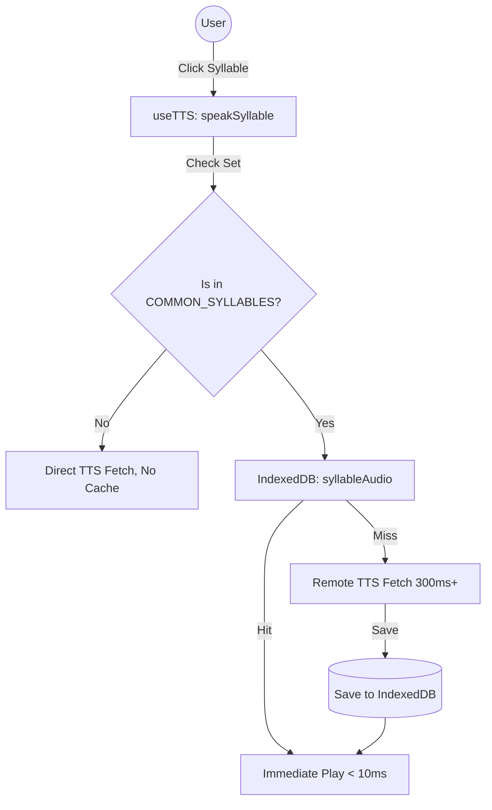

# TTS 音节级分分级缓存技术详解 (TTS Multi-level Caching Demo)

Deep Internalizer 采用了一种基于 **Zipf's Law (齐普夫定律)** 的分级缓存策略，重点通过“通用音节拆分”显著提升了缓存命中率与交互响应速度。

---

## 1. 核心原理：长尾词汇 vs. 高频模式

英语词汇虽然庞大（长尾），但其构成组件（音节、前后缀）的分布极其集中。
- **单词级缓存 (Word Level)**: 解决的是同一个词在不同文档中的重复出现。
- **音节级缓存 (Syllable Level)**: 解决的是不同词汇中共有的“结构模式”。

### 案例模拟：`-tion` 的奇迹
假设用户学习了以下三个单词：
1. `Informa-tion`
2. `Genera-tion`
3. `Adapta-tion`

在**传统缓存**中，这算作 3 次独立的 TTS 请求，缓存占用大，命中率低。
在 **Deep Internalizer** 中：
- 当用户开启“剪刀”模式（Syllable Split）并点击 `-tion` 时：
- 第一次：请求服务器生成 `tion` 的发音，并永久存入 `syllableAudio` 表。
- 第二、三次：**直接从本地缓存读取**。

---

## 2. 技术实现拆解 (Technical Logic)

### 2.1 命中判定逻辑
在 [`ttsService.js`](file:///Users/a2030/01-Project/English%20Learning/deep-internalizer/src/services/ttsService.js) 中，我们定义了一个“黄金音节池”：

```javascript
const COMMON_SYLLABLES = new Set([
    'tion', 'sion', 'ing', 'ness', 'ment', 'able', 'ible',
    'pre', 'pro', 'con', 'dis', 'un', 're', 'ly', 'ful',
    'less', 'ous', 'ive', 'al', 'er', 'est', 'ed', 'en'
]);
```

### 2.2 缓存流转图



---

## 3. 性能数据对比 (Estimated Performance)

| 维度 | 普通 TTS 请求 | 单词缓存命中 | 音节缓存命中 |
| :--- | :--- | :--- | :--- |
| **响应延迟** | 300ms - 800ms | 2ms - 15ms | **2ms - 15ms** |
| **网络开销** | ~50KB / 次 | 0 KB | **0 KB** |
| **多设备复用** | 低 (不同词不同缓存) | 中 (重复词) | **极高 (模式复用)** |

---

## 4. 交互演示 (UX Walkthrough)

请在应用中进行以下操作以感受该技术：
1. 进入任何 Chunk 的 **Step 2 (Vocabulary Build)**。
2. 找到带有高频后缀（如 `ing`, `tion`）的单词。
3. 点击词卡上的 **✂️ (剪刀图标)** 开启分片模式。
4. 快速点击不同的分片。
    - **观察点**：如果是 `-tion` 这种高频分片，你会发现它几乎是瞬时发音，而某些罕见分片可能会有轻微的 Loading 延迟。

---

## 5. 深度探索选项

- **智能音节提取**：是否可以将 `COMMON_SYLLABLES` 从静态列表进化为根据用户学习数据动态统计的“热词后缀”？
- **音质处理**：不同单词切出来的音节发音语调不同，目前采用 0.7x 慢速播放来缓解语调突兀感，是否有更好的算法方案？
- **空间优化**：如何平衡音频质量 (WAV) 与本地存储空间的使用？

[#TTS](file:///Users/a2030/01-Project/English%20Learning/deep-internalizer/docs/tts_cache_demo.md) [#Performance]
